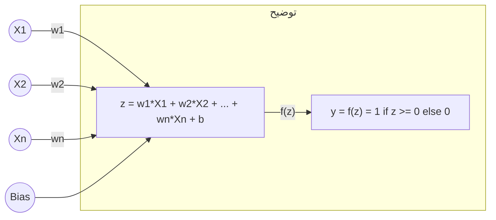
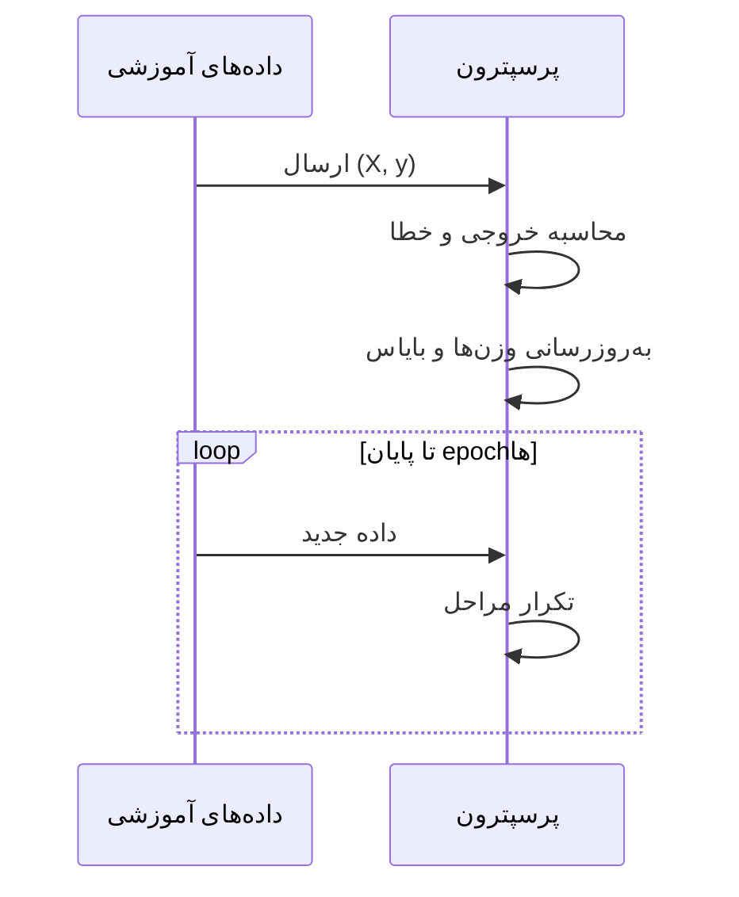
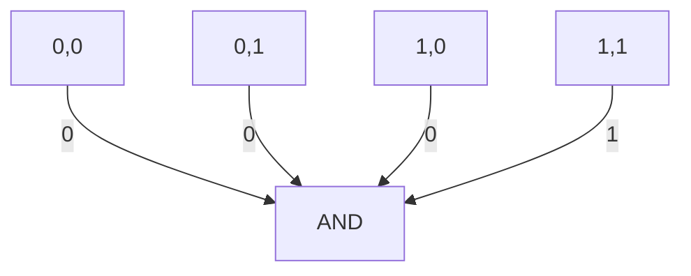
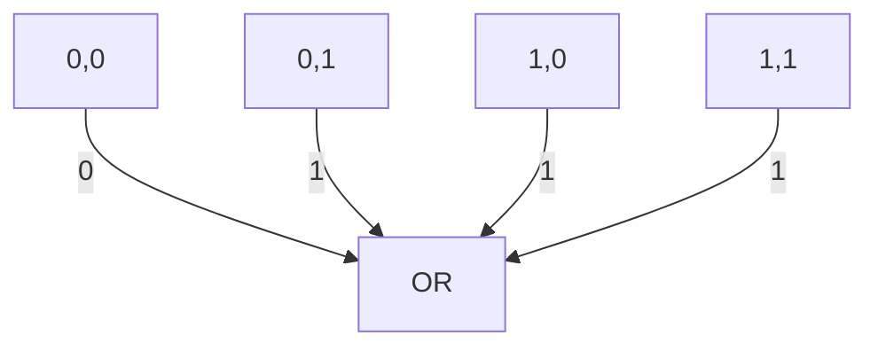
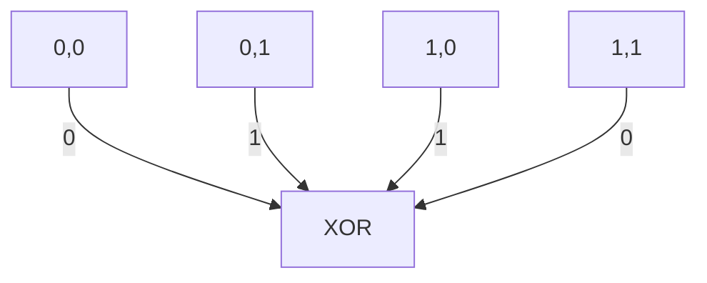
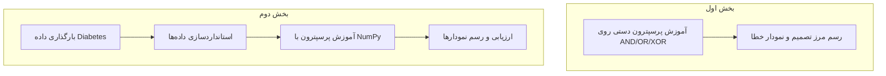
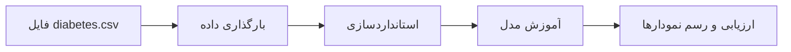

# پروژه پرسپترون و طبقه‌بندی داده‌ها

## مقدمه
این پروژه با هدف آموزش و پیاده‌سازی پرسپترون (Perceptron) برای طبقه‌بندی داده‌ها و تحلیل عملکرد آن روی دروازه‌های منطقی و مجموعه داده Diabetes انجام شده است. در این پروژه ابتدا پرسپترون را به صورت دستی و سپس با استفاده از NumPy پیاده‌سازی کرده‌ایم.

---

## پرسپترون چیست؟
پرسپترون یک مدل ساده شبکه عصبی است که برای طبقه‌بندی دودویی استفاده می‌شود. این مدل با استفاده از وزن‌ها و بایاس، ورودی‌ها را به خروجی صفر یا یک نگاشت می‌کند.

---

## آموزش پرسپترون
در هر تکرار (epoch)، وزن‌ها و بایاس بر اساس خطا به‌روزرسانی می‌شوند تا مدل بهتر یاد بگیرد.

---

## دروازه‌های منطقی
در این پروژه، پرسپترون را برای سه دروازه منطقی آموزش دادیم:

### AND

### OR

### XOR (غیر خطی)

> **نکته:** پرسپترون تک‌لایه نمی‌تواند XOR را به درستی یاد بگیرد چون خطی جداپذیر نیست.

---

## جریان کلی کد پروژه

---

## آموزش روی داده Diabetes
در این بخش، داده‌های واقعی Diabetes را بارگذاری و استانداردسازی کردیم و سپس مدل را آموزش دادیم.

---

## نکات کلیدی و جمع‌بندی
- پرسپترون برای داده‌های خطی جداپذیر عملکرد خوبی دارد.
- نرخ یادگیری و تعداد تکرارها تاثیر زیادی بر همگرایی دارند.
- داده‌های واقعی مثل Diabetes معمولاً کاملاً خطی جداپذیر نیستند.
- استانداردسازی داده‌ها برای یادگیری بهتر ضروری است.

---

**تهیه‌کننده:** دانشجوی هوش مصنوعی (سطح متوسط) 